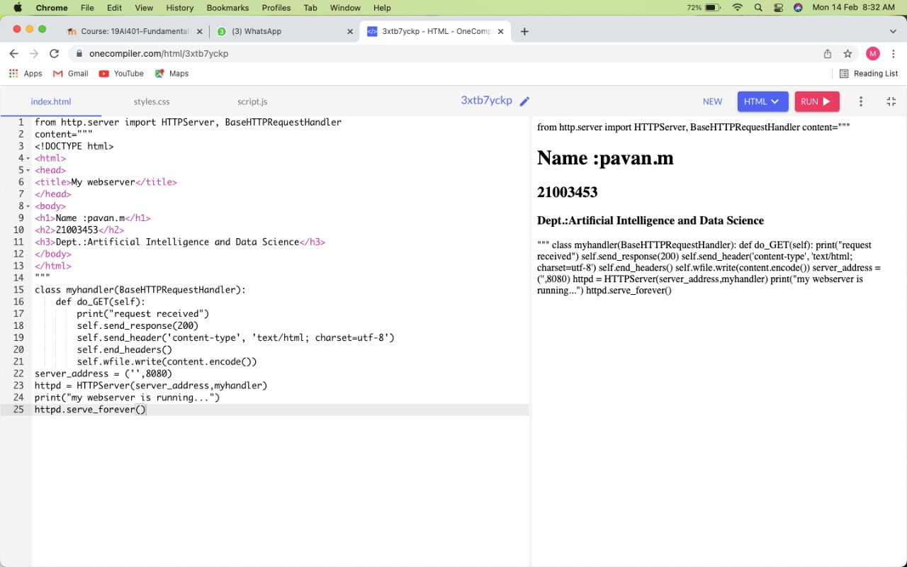
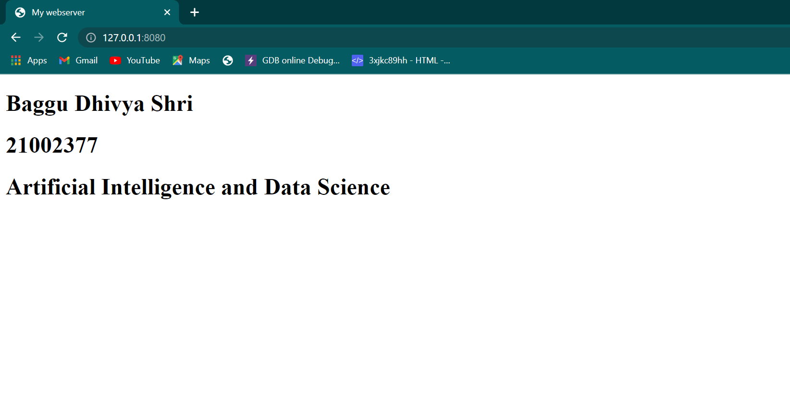

# Developing a Simple Webserver
## AIM:

To develop a simple webserver to serve html pages.
## DESIGN STEPS:
### Step 1:

HTML content creation
### Step 2:

Design of webserver workflow
### Step 3:

Implementation using Python code
### Step 4:

Serving the HTML pages.
### Step 5:

Testing the webserver
## PROGRAM:
from http.server import HTTPServer, BaseHTTPRequestHandler
<<<<<<< HEAD
content="""
=======
content = """
>>>>>>> 46dd39ee5fd30f79754c33268a0cb8a5d47d0e84
<!DOCTYPE html>
<html>
<head>
<title>My webserver</title>
</head>
<body>
<<<<<<< HEAD
<h1>Name :pavan.m</h1>
<h2>21003453</h2>
<h3>Dept.:Artificial Intelligence and Data Science</h3>
=======
<h1>Baggu Dhivya Shri</h1>
<h1>21002377</h1>
<h1>Artificial Intelligence and Data Science</h1>
>>>>>>> 46dd39ee5fd30f79754c33268a0cb8a5d47d0e84
</body>
</html>
"""
class myhandler(BaseHTTPRequestHandler):
    def do_GET(self):
        print("request received")
        self.send_response(200)
        self.send_header('content-type', 'text/html; charset=utf-8')
        self.end_headers()
        self.wfile.write(content.encode())
server_address = ('',8080)
httpd = HTTPServer(server_address,myhandler)
print("my webserver is running...")
httpd.serve_forever()

## OUTPUT:

## RESULT:
Program finished successfully.  
=======

## OUTPUT:

## RESULT:
Therefore, the webserver is developed to server simple html pages.
